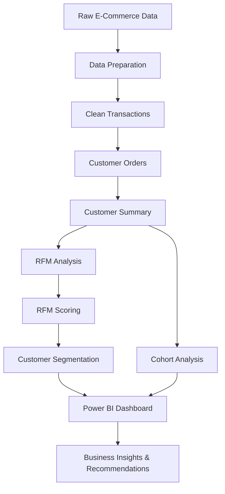

# E-Commerce Customer Retention & RFM Analysis

## Objective

Analyze e-commerce customer behavior and retention to identify high-value customers, retention risks, purchasing patterns, and opportunities to increase customer lifetime value.

The project transforms transaction data into actionable customer insights using SQL, RFM segmentation, cohort analysis, and Power BI.

## Tools & Technologies

- **Google BigQuery :** SQL-based data analysis and transformation
- **SQL -** customer metrics, RFM scoring, segmentation, and cohort analysis
- **Power BI -** interactive dashboard and data visualization
- **DAX -** KPI and business metric calculations

## Analysis Performed
- Revenue & Sales Analysis
- Customer Retention Analysis
- Repeat vs One-Time Customer Analysis
- Purchase Frequency Analysis
- RFM (Recency, Frequency, Monetary) Analysis
- Customer Segmentation
- Cohort Retention Analysis
- Customer Value Analysis

## Key Insights

- $17.74M total revenue generated across 36,969 orders
- 5,878 customers analyzed
- 72.39% of customers are repeat customers
- 27.61% of customers made only one purchase
- Champions represent 22.13% of customers but generate 68.38% of total revenue
- 32.67% of customers are classified as At Risk or Hibernating
- At Risk and Hibernating customers contribute 10.71% of total revenue
- Customer retention varies across cohorts, with some cohorts showing periods of re-engagement

## Business Recommendations

1. **Protect High-Value Customers**
     - *Champions generate a disproportionate share of revenue. Prioritize retention through personalized offers, loyalty benefits, cross-selling, and upselling.*

2. **Improve Second-Order Conversion**
     - *With 1,623 one-time customers, strengthen the first-to-second purchase journey through post-purchase engagement, personalized recommendations, and targeted incentives.*

3. **Reactivate At-Risk Customers**
     - *Target the 1,920 At Risk and Hibernating customers with segmented win-back and reactivation campaigns based on recency and customer value.*

4. **Increase Loyal Customer Value**
     - *Use loyalty programs, cross-selling, upselling, and personalized recommendations to increase purchase frequency and customer lifetime value.*

## Dashboard

The final Power BI dashboard converts the analysis into an executive-focused view of:

Business Performance --> Customer Behavior --> Retention --> Actionable Recommendations

## Project Workflow

## Business Impact

The analysis shifts the focus from only acquiring new customers to improving the value of the existing customer base through retention, reactivation, second-order conversion, and high-value customer protection.